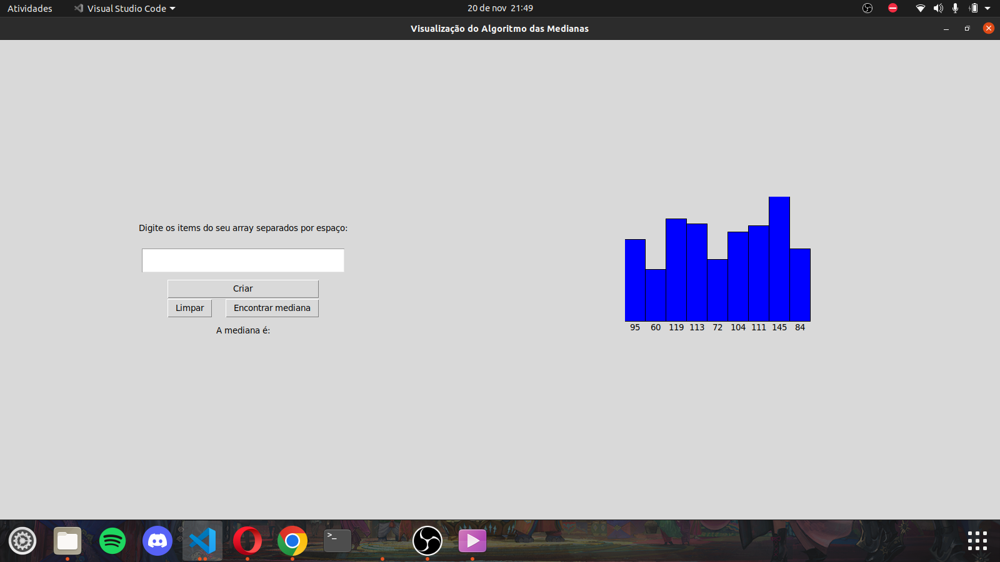
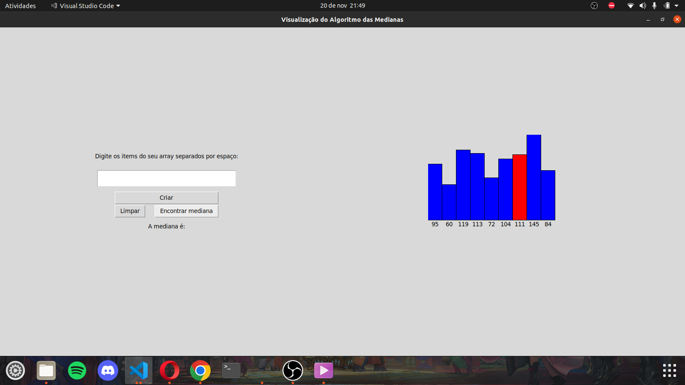
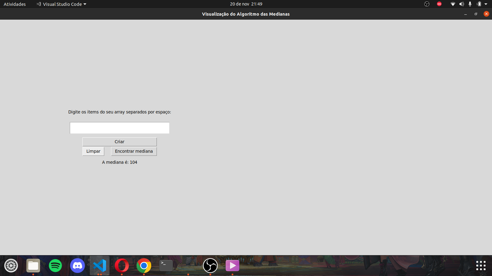
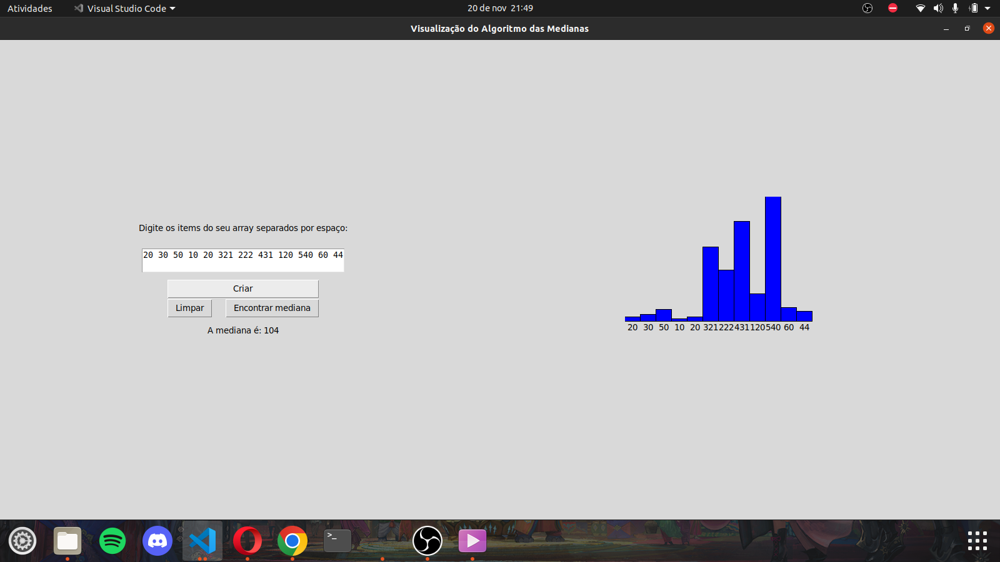

# Median Viewer

**Conteúdo da Disciplina**: Dividir e Conquistar 

## Alunos

| Matrícula  | Aluno                        |
| ---------- | ---------------------------- |
| 19/0036567 | Pedro Lucas Cassiano Martins |
| 19/0020814 | Vinícius Roriz               |

## Vídeo

Link para o vídeo no youtube: https://youtu.be/I89sY0ge8jQ

## Sobre

Para o projeto do conteúdo de Dividir e Conquistar, fizemos um programa que permite ao usuário visualizar o algoritmo de mediana das medianas em funcionamento, mostrando os pivôs escolhidos até ser encontrado a mediana de fato. 
Em uma interface é mostrado array de valores aleatórios representados como um gráfico de coluna. O usuário poderá imediatamente apertar o botão de "Encontrar mediana" para o algoritmo rodar e no gráfico mostrar pivores em vermelho enquanto o algoritmo busca a mediana e assim que encontra mostra ela em verde. O usuário poderá também limpar o gráfico, caso queira, apertando o botão "Limpar" e criar o seu próprio array de valores ao digitar números separados por espaço na caixa de texto (exemplo: 10 20 13 9 22 8 124 43 22 99) e apertar o botão "Criar" mostrando, assim, um gráfico com os valores digitados.

## Screenshots

## Instalação

**Linguagem**: Python 

##### Execute a main.py

`$ python3 main.py`
ou
`python main.py`

## Interface

Botões:

- Encontrar Mediana: Busca a mediana entre os valores do array
- Limpar: Limpa o array
- Criar: Cria um array com os valores no campo de texto

Campo de Texto: Insira números separados por espaços em branco para criar um array
